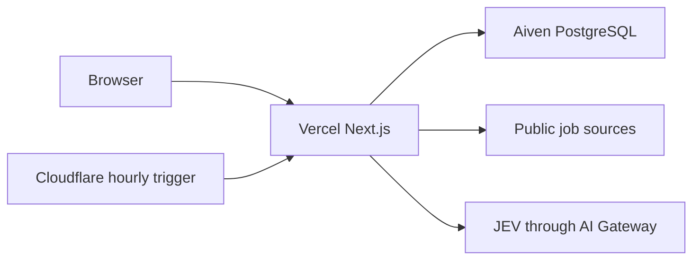

# Cost and capacity guide

## Operating target

Jobradar is tuned for up to 100 near-term users, hourly source freshness, and no paid overage. The supported free deployment is:



The measured pre-upgrade owner dashboard was 742 KB and approximately 1.47 seconds, repeated every minute. A member read was 136 KB or more. The database held 652 jobs, 73 matches, and 3,072 run-job rows, while idle workers woke 1,440 and 17,280 times per day.

## Applied cost boundaries

- Job reads default to 20 summaries and reject limits above 50. Description, image context, and CV review data load by job ID.
- The first workspace page is server rendered. Subsequent search is debounced by 250 ms and stale requests are cancelled.
- A small ETag revision read runs every 15 minutes only in a visible tab and immediately on focus. Ordinary mutations update local state or one focused resource.
- Web pools default to one connection. `DATABASE_WEB_URL` and `DATABASE_WORKER_URL` allow a future pooled/direct split.
- The Cloudflare trigger calls a POST endpoint that claims one source lease. It drains due work without a permanent worker.
- Conditional source requests turn `304` responses into lightweight runs. Stable job hashes prevent unchanged writes, rematching, and JEV queueing.
- JEV background work is disabled by default. Members retain the daily limit, while all users share a monthly request/token cap. Cached reviews do not call the provider. Provider `402` and `429` responses pause AI locally.
- Daily maintenance aggregates old runs and removes eligible detailed run, rate-limit, and low-severity security rows after 90 days. Saved, applied, reviewed, CV-derived, and personal job data are preserved.

## Free-tier setup

1. Use Vercel Hobby for the Next.js app without `vercel.json` cron.
2. Use the existing Aiven PostgreSQL free service and keep `DATABASE_POOL_MAX=1`.
3. Deploy `cloudflare/` and add encrypted `JOBRADAR_URL` and `CRON_SECRET` variables.
4. Keep paid AI overage and purchased credits disabled in the Vercel AI Gateway account.
5. In owner Settings, leave background JEV disabled until the request/token cap is intentionally reviewed.

References: [Aiven free PostgreSQL limits](https://aiven.io/docs/products/postgresql/concepts/pg-free-tier), [Cloudflare Worker limits](https://developers.cloudflare.com/workers/platform/limits/), [Vercel cron limits](https://vercel.com/docs/cron-jobs/usage-and-pricing), and [AI Gateway pricing](https://vercel.com/docs/ai-gateway/pricing).

## Capacity verification

Run:

```sh
npm run db:migrate
npm test
npm run typecheck
npm run lint
npm run build
npm run perf:load
```

The load simulation issues 100 authenticated-scope summary/job projections through the configured one-connection pool and reports p50/p95 latency, maximum payload, and the top query-plan node. Check the owner Performance and Cost panel after collection for database size, queue age, source totals, and AI use.

## Upgrade triggers

Move to paid capacity only when measurements justify it:

- Database storage above 750 MB or sustained connection pressure: add a transaction pooler or larger PostgreSQL plan.
- p95 focused reads above one second after warm-up: inspect query plans and indexes before adding infrastructure.
- More due sources than the hourly trigger drains: allow two concurrent lease claims or use a scheduled container.
- A route exceeds 150 KB for owners or 75 KB for members: reduce projection fields or page size.
- The workspace consistently reaches the AI cap: review whether deterministic results are sufficient before approving any spend.

Do not add Redis, Elasticsearch, Kafka, or another hosted database for this capacity range.
