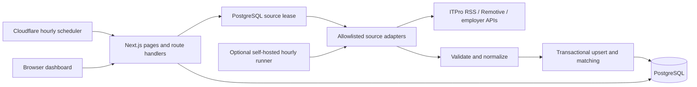
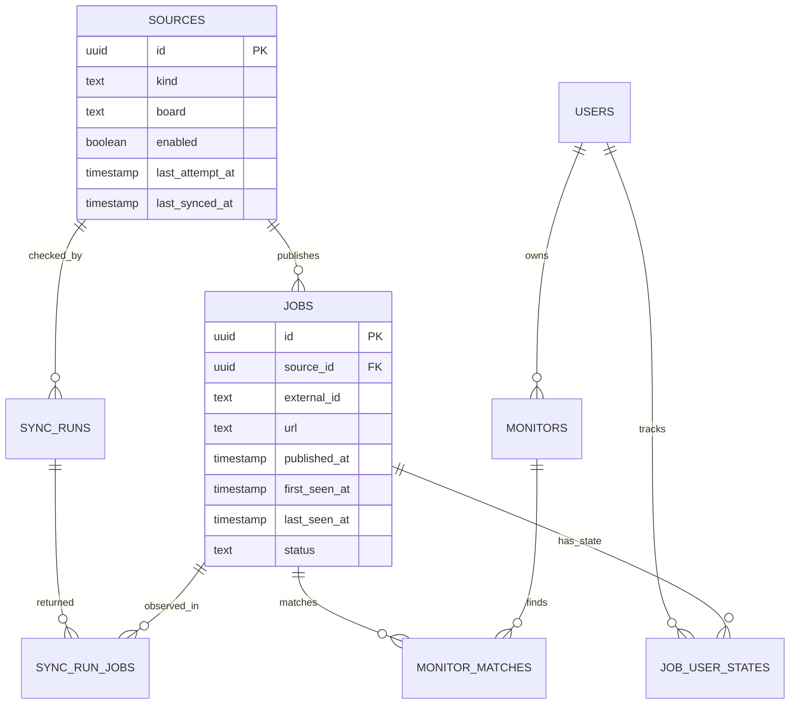

# Architecture and decisions

## Problem and scope

Reduce repeated visits to Sri Lankan and remote job websites. Capture listings from supported feeds, retain their origin and discovery history, match personal interests, and support a shortlist/application workflow. The shared source catalog serves owner and member accounts, while monitor rules, matching views, and job workflow state are scoped to the account that created them. Owners can inspect the full collection and manage sources; members receive only matched or personally tracked listings.

## System shape

One TypeScript codebase is organized into independently understandable boundaries:

- `src/components`: presentation, responsive navigation, account entry, and dashboard interaction state.
- `src/app/api`: request/response, authentication, validation and authorization.
- `src/lib/connectors.ts`: fixed source endpoints and source-specific validation/normalization.
- `src/lib/sync.ts`: scheduling, collection orchestration, transactional storage and match rebuilding.
- `src/lib/repository.ts`: read projections with explicit database-to-UI naming.
- `src/lib/matching.ts`: keyword/location matching and safe text/URL helpers.
- `src/lib/auth.ts`, `security.ts`, `rate-limit.ts`, and `request-body.ts`: session, authorization, audit, persistent throttling, and streamed input boundaries.
- `db`: versioned database migrations.
- `scripts`: deploy-time migrations and standalone worker entry points.

Use the hourly Cloudflare trigger or the self-hosted hourly runner. Both atomically claim one due source with `FOR UPDATE SKIP LOCKED`; expired leases are recoverable and scheduled work never depends on an open dashboard.

## Data model

`(source_id, external_id)` is the import identity. Retries update source-owned fields but preserve owner-owned status and the original first-seen timestamp. Cross-source duplicates remain separate so attribution is not accidentally erased. A future canonical job table can group them while preserving a source-listing table.

`published_at` is nullable; missing dates must remain unknown. Do not substitute fetch time or Greenhouse’s `updated_at` for publication. `first_seen_at` and `last_seen_at` reflect this platform’s observations. All timestamps are stored as PostgreSQL `timestamptz`, serialized as ISO strings, and displayed in the viewer’s local timezone.

`sync_runs` records start/end/status, accepted tech-record count, number added, and error. `sync_run_jobs` records the exact listings returned by each successful run and whether each listing was new in that run, which powers drill-down links from collection history. It does not store a full version history of changed descriptions. `monitor_matches` is a derived index that can be rebuilt. `job_user_states` separates each account's saved, applied, archived, and reviewed state from the shared source listing. `schema_migrations` ensures the initial seed is not reapplied after an owner deletes a monitor.

`user_sessions` stores only token hashes and privacy-safe device/network hashes. `security_events` records access-control and session events. `request_rate_limits` provides fixed-window write limits shared by every web instance. `ai_usage_policy` and `ai_job_analysis_usage` enforce the owner-managed daily member analysis allowance with atomic reservations; successful and active reservations count, failed reservations do not.

Career-stage matching classifies title and tag signals into Internship, Entry, Mid, Senior, or Other / unspecified before applying a user's onboarding preference. Internship covers intern, trainee, apprentice, and placement language; Entry covers junior, associate, graduate, and level-one language. The browser and PostgreSQL use the same precedence, with senior markers winning in compound titles such as “Senior Associate Engineer.” Role keywords, country-aware location coverage, work mode, and custom exclusions still apply after the career-stage gate.

Numbered role suffixes are interpreted consistently in the browser and PostgreSQL: `(1)` / `I` is Entry, `(2)` / `II` is Mid, and `(3)` / `III` is Senior when attached to a role or explicit level marker. Each monitor stores its accepted work arrangements. Onboarding configures those modes per country, while Worldwide is always Remote.

New accounts complete a four-step preference flow. Career stage, selected roles, locations, and work arrangements generate a reviewable set of user-owned monitors. Users can remove generated monitors or add custom keyword monitors before completing setup, and can continue editing those monitors from the dashboard.

## Collection sequence and failure handling

1. Atomically claim one enabled due source and give it a 12-minute lease.
2. Mark only expired runs for that source as interrupted.
3. Send saved `ETag` and `Last-Modified` validators. A `304` records a lightweight successful run without parsing, job writes, matching, or JEV queueing.
4. Fetch only a supported fixed host; reject redirects and cap time and response size.
5. Validate and normalize the response, then hash stable source-owned job content.
6. Write only new or changed jobs, batch the run links, and rebuild matches or queue intelligence only for changed job IDs.
7. Commit source health, daily counters, and run status in the same transaction, then release the lease.
8. On failure, roll back job changes, preserve prior records, store a bounded error, and release the lease for the next interval.

No absence-based closure is inferred from limited feeds. The initial release does not automatically deactivate jobs. A future reconciliation process should only close jobs after a complete source snapshot or an authoritative closure signal.

## Security and trust boundaries

- Dashboard reads and mutations require an active database session. The first registered account becomes owner; subsequent accounts are members.
- Passwords use salted scrypt hashes. Browsers receive an opaque HTTP-only, same-site session token whose SHA-256 hash and seven-day expiry are stored in PostgreSQL.
- Account attempts are limited by normalized-account and keyed-network buckets. Every authenticated mutation also passes a PostgreSQL-backed per-user route limit; manual source collection is limited more strictly. Responses include `Retry-After` when blocked.
- Members receive an owner-configurable daily CV-to-job analysis allowance; the default is five per Sri Lanka calendar day. Reservations are atomic, cached results are free, failures release allowance, and owners remain unlimited.
- Personal JEV reviews do not hold a PostgreSQL connection while waiting for the model. The API reconnects for the validated write phase; idempotent review reads retry once on a fresh connection after transient termination.
- `APP_URL` must equal the production HTTPS origin. Production writes fail closed when it is absent or malformed. Configure HTTPS at the host/reverse proxy.
- Forwarded network headers are ignored unless `TRUST_PROXY_HEADERS=true`; enable it only when the trusted proxy overwrites those headers. Raw IP addresses and full user-agent strings are never stored.
- Cron access requires a separate Bearer secret. Source URLs and job descriptions cannot trigger backend requests.
- Request bodies are content-type checked and byte-limited while streaming. SQL is parameterized. Job HTML is displayed as React-escaped plain text, never through `dangerouslySetInnerHTML`. XML DTD/entity declarations are rejected. CSV cells are escaped and spreadsheet formula prefixes are neutralized.
- Private API responses are marked `no-store`. A nonce-based CSP restricts script execution; framing, MIME sniffing, browser permissions, opener behavior, and production transport are hardened with response headers.
- Local storage is used only for the explicitly labeled demo. Production data requires PostgreSQL; database failure does not fall back to fabricated live results.

## Scaling decisions and measurable next steps

The web and scheduled runner deploy independently. Focused reads cap each job-summary fetch at 50, descriptions load by ID, and a sub-kilobyte revision resource replaces full-data polling. Every filtered job response includes its database total, allowing the interface to show accurate summary, tab, range, and page counts while fetching additional cursor pages only when the user reaches them. Hidden tabs make no periodic checks; visible tabs check every 15 minutes and on focus.

| When measurements show…                                      | Make this change                                                                                                                                                                                 |
| ------------------------------------------------------------ | ------------------------------------------------------------------------------------------------------------------------------------------------------------------------------------------------ |
| A route approaches its focused payload target                | Reduce its selected fields or page size; never restore the monolithic dashboard response.                                                                                                        |
| Incremental matching approaches the collection interval      | Process matching in bounded batches and keep a durable cursor and rule version. Collection now recomputes changed jobs, monitor edits recompute one monitor, and onboarding recomputes one user. |
| Many employer boards exceed one hourly trigger window        | Increase scheduler invocations up to two concurrent claims and retain the existing lease/idempotency boundary.                                                                                   |
| More than 100 active users or persistent connection pressure | Add a transaction pooler through `DATABASE_WEB_URL`; keep worker access separate through `DATABASE_WORKER_URL`.                                                                                  |
| Database connection count grows with web instances           | Give web reads/writes a transaction-pooled connection. Keep a separate direct/session-pooled worker connection for session advisory locks.                                                       |
| Users need workspaces shared by multiple organizations       | Add workspace and membership tables, scope sources and users to a workspace, and add tenant-isolation tests before promising organization-level privacy.                                         |
| Users need email/push notifications                          | Add an outbox keyed by `(monitor, job, channel)` in the same import transaction, then deliver separately with retries and opt-in preferences.                                                    |
| Older record volume becomes significant                      | Establish an explicit retention policy, keep provenance, archive old descriptions, and partition large run/event tables if measurements justify it.                                              |

Redis and a dedicated search engine are optional future tools, not prerequisites. PostgreSQL can supply the first queue and search capabilities. Container images avoid tying the architecture to one hosting vendor.

## Known tradeoffs

The UI keeps loaded cursor pages in memory, while list totals and page counts come from the same filtered PostgreSQL query used by the active tab. Dashboard summary counts come from a separate visibility-scoped aggregate, so totals do not depend on how many cursor pages the browser has loaded. Incremental matching limits work to changed jobs, one edited monitor, or one onboarding user. JEV is optional and bounded by a database budget; deterministic matching remains available when AI is paused. Public feeds can still be incomplete, and the system does not claim automatic failover.
