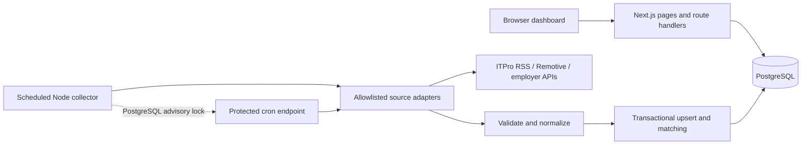
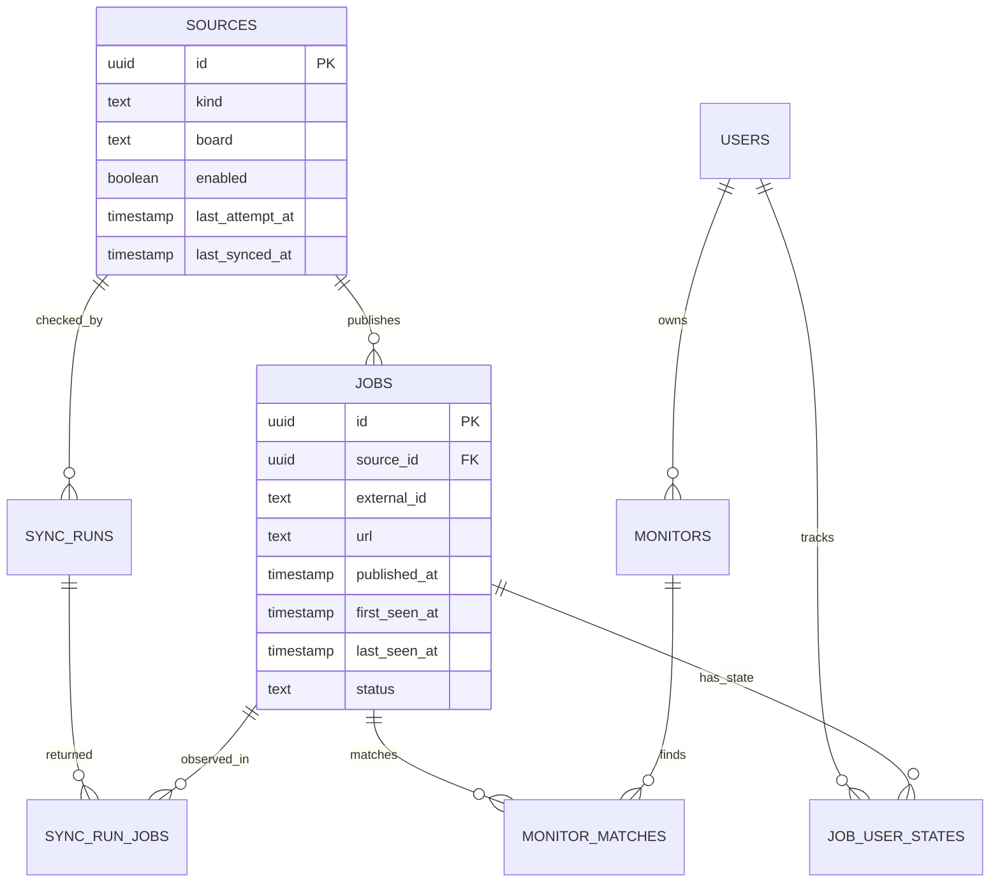

# Architecture and decisions

## Problem and scope

Reduce repeated visits to Sri Lankan and remote job websites. Capture listings from supported feeds, retain their origin and discovery history, match personal interests, and support a shortlist/application workflow. The shared source catalog serves owner and member accounts, while monitor rules, matching views, and job workflow state are scoped to the account that created them. Owners can inspect the full collection and manage sources; members receive only matched or personally tracked listings.

## System shape

One TypeScript codebase is organized into independently understandable boundaries:

- `src/components`: presentation, responsive navigation, account entry, and dashboard interaction state.
- `src/app/api`: request/response, authentication, validation and authorization.
- `src/lib/connectors.ts`: fixed source endpoints and source-specific validation/normalization.
- `src/lib/sync.ts`: scheduling, collection orchestration, transactional storage and match rebuilding.
- `src/lib/repository.ts`: read projections with explicit database-to-UI naming.
- `src/lib/matching.ts`: keyword/location matching and safe text/URL helpers.
- `db`: versioned database migrations.
- `scripts`: deploy-time migrations and standalone worker entry points.

Use the worker **or** a platform scheduler calling `/api/cron`. The same lock and interval checks protect both paths. Scheduled work does not depend on the dashboard being open.

## Data model

`(source_id, external_id)` is the import identity. Retries update source-owned fields but preserve owner-owned status and the original first-seen timestamp. Cross-source duplicates remain separate so attribution is not accidentally erased. A future canonical job table can group them while preserving a source-listing table.

`published_at` is nullable; missing dates must remain unknown. Do not substitute fetch time or Greenhouse’s `updated_at` for publication. `first_seen_at` and `last_seen_at` reflect this platform’s observations. All timestamps are stored as PostgreSQL `timestamptz`, serialized as ISO strings, and displayed in the viewer’s local timezone.

`sync_runs` records start/end/status, accepted tech-record count, number added, and error. `sync_run_jobs` records the exact listings returned by each successful run and whether each listing was new in that run, which powers drill-down links from collection history. It does not store a full version history of changed descriptions. `monitor_matches` is a derived index that can be rebuilt. `job_user_states` separates each account's saved, applied, archived, and reviewed state from the shared source listing. `schema_migrations` ensures the initial seed is not reapplied after an owner deletes a monitor.

Career-stage matching classifies explicit title and tag signals before applying a user's onboarding preference. Explicit internship, entry, mid-level, and senior labels cannot cross into another selected stage. Unlabelled roles remain eligible because many sources omit seniority; role keywords, location, work mode, and exclusions still apply. The browser and PostgreSQL use the same precedence, with senior markers winning in compound titles such as “Senior Associate Engineer.”

New accounts complete a four-step preference flow. Career stage, selected roles, locations, and work arrangements generate a reviewable set of user-owned monitors. Users can remove generated monitors or add custom keyword monitors before completing setup, and can continue editing those monitors from the dashboard.

## Collection sequence and failure handling

1. Obtain a dedicated connection and the global collection lock. A concurrent invocation exits without collecting.
2. Mark orphaned `running` records as interrupted after acquiring the lock.
3. Select enabled sources whose last attempt is older than their allowed interval.
4. Persist attempt time and a new run before fetching. Failed attempts also observe the cooldown.
5. Fetch only a supported fixed host; employer slugs cannot inject a URL or path. Redirects are rejected. Apply a 25-second timeout and a 12 MB response limit.
6. Validate, convert descriptions to text, reject unsafe destination schemes, and apply the explicit tech title/tag heuristic.
7. In one transaction, upsert each accepted record, rebuild monitor matches, mark the run successful and update source health.
8. On failure, roll back that source’s changes, retain previous jobs, record a failure, and continue to the next source. Retry on its next scheduled interval.
9. Release the lock and connection. The worker wakes every minute to discover due sources, not to fetch each source every minute.

No absence-based closure is inferred from limited feeds. The initial release does not automatically deactivate jobs. A future reconciliation process should only close jobs after a complete source snapshot or an authoritative closure signal.

## Security and trust boundaries

- Dashboard reads and mutations require an active database session. The first registered account becomes owner; subsequent accounts are members.
- Passwords use salted scrypt hashes. Browsers receive an opaque HTTP-only, same-site session token whose SHA-256 hash and seven-day expiry are stored in PostgreSQL.
- Account attempts are limited per normalized-email bucket in PostgreSQL to 10 attempts per five-minute window. Source management and manual collection additionally require the owner role.
- `APP_URL` must equal the production HTTPS origin; it also determines the secure-cookie flag. Configure HTTPS at the host/reverse proxy.
- Cron access requires a separate Bearer secret. Source URLs and job descriptions cannot trigger backend requests.
- SQL is parameterized. Job HTML is displayed as React-escaped plain text, never through `dangerouslySetInnerHTML`. XML DTD/entity declarations are rejected. CSV cells are escaped and spreadsheet formula prefixes are neutralized.
- Local storage is used only for the explicitly labeled demo. Production data requires PostgreSQL; database failure does not fall back to fabricated live results.

## Scaling decisions and measurable next steps

The web and worker are separate processes and can be deployed independently. The current collector intentionally serializes work behind one global lock. This prioritizes reliable retries and source friendliness for the initial few sources.

| When measurements show…                                          | Make this change                                                                                                                                                                                                               |
| ---------------------------------------------------------------- | ------------------------------------------------------------------------------------------------------------------------------------------------------------------------------------------------------------------------------ |
| Loading 1,000 job summaries affects response size or latency     | Add cursor pagination and server-side filters. Full descriptions already load through an authorized job-detail endpoint. Use the existing date/source indexes and PostgreSQL full-text index.                                  |
| Incremental matching approaches the collection interval          | Process matching in bounded batches and keep a durable cursor and rule version. Collection now recomputes changed jobs, monitor edits recompute one monitor, and onboarding recomputes one user.                               |
| Many employer boards cause a collection to exceed request limits | Always use the independent worker. Add a PostgreSQL queue such as pg-boss, leases per source, bounded concurrency, retries with jitter, and domain-specific request budgets. Verify the queue’s deployment requirements first. |
| Multiple worker instances are needed                             | Replace the global lock with a source-level lease plus a durable queue; make all tasks idempotent and fence stale lease holders.                                                                                               |
| Database connection count grows with web instances               | Give web reads/writes a transaction-pooled connection. Keep a separate direct/session-pooled worker connection for session advisory locks.                                                                                     |
| Users need workspaces shared by multiple organizations           | Add workspace and membership tables, scope sources and users to a workspace, and add tenant-isolation tests before promising organization-level privacy.                                                                       |
| Users need email/push notifications                              | Add an outbox keyed by `(monitor, job, channel)` in the same import transaction, then deliver separately with retries and opt-in preferences.                                                                                  |
| Older record volume becomes significant                          | Establish an explicit retention policy, keep provenance, archive old descriptions, and partition large run/event tables if measurements justify it.                                                                            |

Redis and a dedicated search engine are optional future tools, not prerequisites. PostgreSQL can supply the first queue and search capabilities. Container images avoid tying the architecture to one hosting vendor.

## Known tradeoffs

Client-side filtering caps the dashboard at the newest 1,000 record summaries, so match counts shown by the dashboard are for that loaded window. Full descriptions load only when an authorized user opens a job. Incremental matching limits routine work to changed jobs, one edited monitor, or one onboarding user, while a full rebuild remains available for maintenance. There is no load-test claim, automatic failover claim, or guarantee that public feeds are complete. Revisit these decisions against actual source count, data volume, and latency rather than labeling the current release infinitely scalable.
