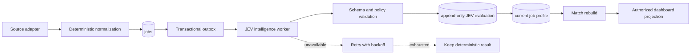

# JEV integration architecture

## Objective

Add structured job intelligence to Jobradar while preserving the existing
collector, authorization model, user-specific monitors, and deterministic
matching guarantees.

## Architectural boundary

JEV makes narrow semantic decisions. Jobradar owns everything else.

| Jobradar owns                                 | JEV owns                                               |
| --------------------------------------------- | ------------------------------------------------------ |
| Source access and rate limits                 | Role-family classification                             |
| HTML/feed/API parsing                         | Career-stage classification when text is ambiguous     |
| Canonical job persistence                     | Work-arrangement classification when text is ambiguous |
| Location hierarchy and country expansion      | Technology-role relevance judgment                     |
| Authentication and owner/member authorization | Job-content quality judgment                           |
| Monitor rules and hard exclusions             | Typed probabilities/confidence for its answers         |
| Retry, caching, audit, policy, and UI wording | No side effects                                        |

JEV does not receive authority to save jobs, alter preferences, expose owner
data, trigger collection, or perform an external action.

## Target flow



### Collection transaction

`src/lib/sync.ts` continues to fetch and upsert jobs. For each inserted or
materially changed job it also upserts an intelligence queue item keyed by the
job and a content hash. This happens in the same database transaction as the
job change, so committed jobs cannot be lost between persistence and queuing.

The collection transaction does **not** call JEV. It can finish successfully
when JEV is slow or unavailable.

### Intelligence worker

A separate worker claims due queue rows with PostgreSQL locking, builds a
bounded state object, calls JEV once for the versioned question set, validates
the result, records an append-only evaluation, and updates the job's current
materialized profile.

Only a profile whose content hash still matches the current job may become
current. A late response for an older description remains auditable but cannot
overwrite a newer profile.

### Match integration

Rollout has three modes:

- `off`: no JEV requests; current behavior only.
- `shadow`: persist and evaluate JEV results, but do not change user-visible
  matches.
- `assisted`: use approved high-confidence fields while retaining deterministic
  hard gates and fallback behavior.

In assisted mode, JEV may resolve an ambiguous career stage. It may not weaken
an explicit incompatible signal. For example, a title containing an explicit
senior marker cannot be shown to an entry-level user because of a lower
confidence JEV answer.

## Proposed repository placement

This structure extends the repository's current flat `src/lib` organization
without creating a second application architecture:

```text
src/lib/jev/
  client.ts                 # server-only SDK wrapper
  contract.ts               # validated request/response types
  questions/
    job-classification-v1.ts
  policy.ts                 # confidence and abstention policy
src/lib/intelligence/
  queue.ts                  # claim, retry, and completion operations
  job-state.ts              # bounded state construction
  job-profile.ts            # materialization rules
scripts/
  intelligence-worker.ts
db/
  018_job_intelligence.sql  # next number must be rechecked at implementation
tests/
  jev-contract.test.ts
  job-intelligence.test.ts
```

The JEV client is a test seam, not a multi-provider framework. Production has
one implementation backed by JEV and test code uses a fixed fake.

## State construction

Send only fields needed for the decision:

```text
job id is excluded
source kind
title
company (only where needed for interpretation)
normalized location
remote flag
employment type
tags
bounded plain-text description
deterministic signals already detected by Jobradar
```

URLs, user identities, session data, monitor ownership, saved/applied status,
and unrelated source metadata are excluded. State text has a documented byte
and character limit. The implementation stores a hash of the exact state and a
redacted diagnostic snapshot rather than logging request bodies.

## Deterministic preprocessing

Before JEV is called, Jobradar computes:

- canonical whitespace and safe plain text;
- source and external-id fingerprint;
- content hash over classification-relevant fields;
- explicit career-stage signals, including numbered and Roman-numeral levels;
- location/country coverage and work-mode evidence;
- exact keyword and exclusion matches.

These facts are included in state where helpful and remain available for hard
policy gates.

## Requirement extraction without another model

Requirement intelligence is deferred until job classification is stable. When
added, Jobradar will identify candidate requirement phrases with deterministic
section, bullet, sentence, dictionary, and regular-expression rules. JEV may
label each supplied phrase, but it will not invent or rewrite requirements.
Every accepted requirement must retain its exact evidence span and offsets in
the source text. Unsupported or ambiguous text remains unclassified.

## Authorization

JEV processing is service-side and not a user-facing API capability. Existing
owner/member rules remain in repository projections:

- owners may view system-wide collection and intelligence health;
- members may view only profiles attached to jobs visible through their own
  monitors and personal job state;
- raw JEV diagnostics and errors are owner-only;
- the API key is available only to server-side worker and personal-review
  boundaries;
- every mutation requires the configured same origin and passes a
  PostgreSQL-backed per-user route limit;
- personal review calls reserve the member's daily allowance atomically before
  contacting JEV; failed calls release it, cached reviews are free, and owners
  bypass the daily quota;
- private API responses are non-cacheable and return only UI-required fields.

## Resilience and performance

- A queue item is idempotent on `(job_id, content_hash, question_set_version)`.
- Only one active claim exists for the same item.
- Transient failures use capped exponential backoff with jitter.
- Authentication, validation, and quota failures are classified separately and
  do not retry indefinitely.
- A circuit breaker stops new calls after repeated service failures while
  collection continues.
- Previously approved profiles remain readable during an outage.
- Match rebuilding is incremental for affected job ids.
- Batch size and concurrency are configuration, with conservative defaults set
  after the Stage 0 spike.

## Observability

Record counts and timings without raw descriptions:

- queued, claimed, succeeded, retrying, dead-letter, and stale-result counts;
- request latency and end-to-end queue age;
- cache/content-hash reuse rate;
- validation and policy-abstention rate;
- per-question confidence distributions;
- source-segmented disagreement with deterministic rules;
- number of matches added/removed in shadow comparison.

## Later capabilities

Candidate profiles, CV evidence, and application tracking require separate
privacy, retention, consent, and product decisions. They can reuse the same
typed-decision pattern after job intelligence is proven, but they are not part
of the first integration.

## Personal review boundary

Personal review is an on-demand boundary. The browser extracts the CV and any
image-based listing text locally; only content the user has reviewed and saved
is eligible for comparison. The application builds a deterministic fit profile
from the approved CV and effective job description, then sends JEV normalized
role, level, duration, skill, and exact evidence fields without identity,
contact details, or PDF bytes.

Saved review identity includes the CV revision, effective job content,
`cv-fit-v4` contract version, and a calendar-month anchor only when an approved
CV contains an ongoing role. A changed CV, changed listing, approved image
extraction, contract update, or relevant month rollover produces a fresh review
while unchanged input reuses the cached result without spending a member
allowance.
